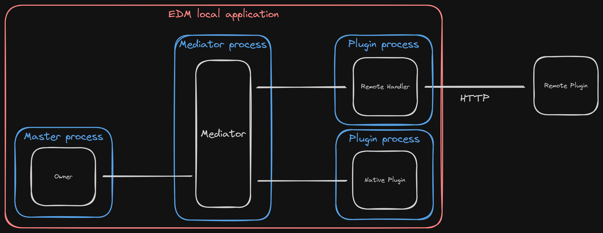

# EDM general idea

#### Owner
- Runs in the master process
- Spawns and closes other processes
- Can be run in blocking or non-blocking mode

#### Mediator
- Runs in a dedicated process
- Receives all events and stores then in a FIFO queue
- Broadcasts events from the queue to `Owner` and all plugins

#### Native Plugin
- Each of them runs in a separate process
- Handles and emits events
- Connected directly to the `Mediator` via multiprocessing
- Spawned by the `Mediator`

#### Remote Handler
- Special type of `Native Plugin`
- Converts all communication to HTTP and sends it to `Remote Plugin`
- Must have filters and security measures implemented

#### Remote Plugin
- It can be another EDM-based app, but it doesn't have to be
- Runs either locally or remotely
- It must conform to communication standard defined by EDM

# Other notes

1. Multiprocessing communication can be implemented via gateway so that it can be easily replaced with other methods later.
2. ...
